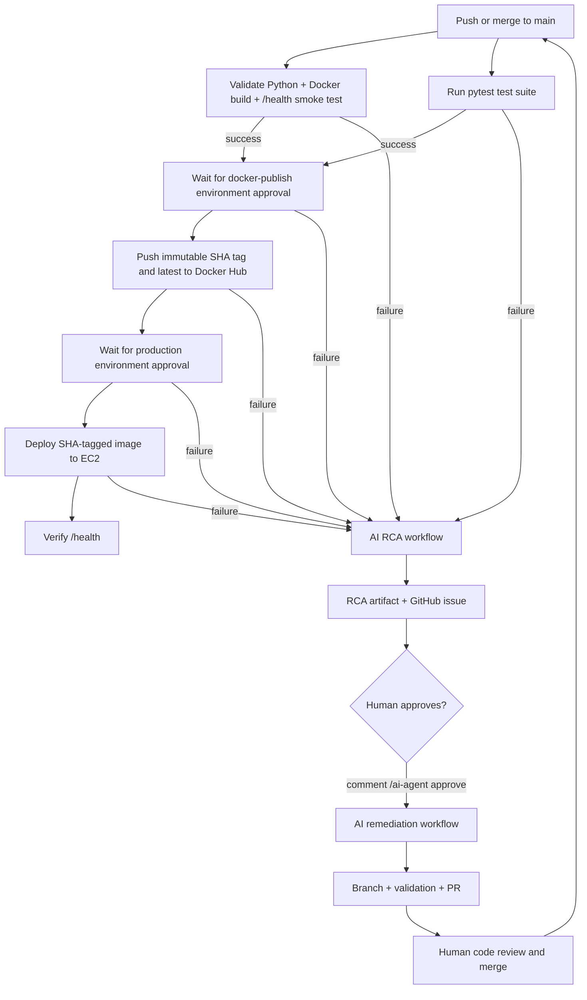

# AI CI/CD Remediation Agent Runbook

This project now has a human-approved AI remediation loop for GitHub Actions, Docker, and EC2 deployment failures.

## What the agent does

1. The normal `Build and Deploy AI DevOps Assistant` workflow validates the Flask app, runs pytest, and builds/smoke-tests the Docker image.
2. If that workflow fails, `AI Agent - RCA on CI/CD Failure` runs automatically.
3. The RCA workflow collects the failed workflow metadata/logs, reviews the CI/CD and Docker files, and uploads an artifact named `ai-agent-rca-run-<run_id>`.
4. The RCA workflow also opens a GitHub issue with:
   - failure evidence,
   - likely root cause,
   - solution options,
   - recommended fix plan,
   - validation/rollback plan,
   - approval instructions.
5. A maintainer reviews the issue. If the team approves the agent to prepare a fix, comment:

   ```text
   /ai-agent approve
   ```

6. `AI Agent - Human Approved Remediation` then creates a branch, applies only allow-listed CI/CD/Docker/app changes, validates Python and Docker, and opens a pull request.
7. A human reviews and merges the pull request.
8. After merge to `main`, Docker publish and production deploy are still gated by GitHub Environment approvals.

## What the agent never does

- It never merges directly to `main`.
- It never deploys production without GitHub Environment approval.
- It never bypasses Docker publishing approval.
- It never hard-codes secrets.
- It only edits files listed in `scripts/ai_ci_agent.py` under `ALLOWED_REMEDIATION_PATHS`.

## Required GitHub secrets

Configure these in **Settings → Secrets and variables → Actions → Secrets**:

| Secret | Purpose |
|---|---|
| `DOCKERHUB_USERNAME` | Docker Hub username used to push and pull images. |
| `DOCKERHUB_TOKEN` | Docker Hub access token. Use a token, not your Docker Hub password. |
| `EC2_HOST` | EC2 public DNS name or IP address. |
| `EC2_SSH_KEY` | Private SSH key for the `ubuntu` user on the EC2 host. |
| `GEMINI_API_KEY` | Gemini key used by the Flask app. The AI agent also falls back to this if `AI_AGENT_API_KEY` is not set. |
| `AI_AGENT_API_KEY` | Optional but recommended separate Gemini key for CI/CD RCA and remediation. |

## Optional GitHub variable

Configure under **Settings → Secrets and variables → Actions → Variables**:

| Variable | Default | Purpose |
|---|---|---|
| `AI_AGENT_MODEL` | `gemini-1.5-flash` | Gemini model used by the RCA/remediation agent. |

## Required GitHub Environments

Create these under **Settings → Environments**.

### `docker-publish`

Recommended settings:

- Required reviewers: at least one repo maintainer.
- Deployment branches: `main` only.

This makes Docker Hub publishing wait for human approval after CI validation passes.

### `production`

Recommended settings:

- Required reviewers: at least one repo maintainer.
- Deployment branches: `main` only.

This makes the EC2 deployment wait for human approval after the Docker image is published.

## Normal operational flow



## Manual RCA run

If you want the agent to analyze an older failed run:

1. Open **Actions → AI Agent - RCA on CI/CD Failure**.
2. Click **Run workflow**.
3. Enter the failed run ID.
4. Review the uploaded artifact and generated issue.

## Manual remediation run

If the issue comment trigger is not desired:

1. Open **Actions → AI Agent - Human Approved Remediation**.
2. Click **Run workflow**.
3. Enter the RCA issue number and optional failed run ID.
4. Review the generated PR.

## Validations performed before Docker publish/deploy

- Python dependencies install.
- `python -m py_compile app.py`.
- Pytest dependencies install from `requirements-dev.txt`.
- `pytest -q` must pass in the separate `pytest` job.
- Docker image build with Buildx.
- Container run with a dummy `GEMINI_API_KEY`.
- `/health` endpoint smoke test.

The `docker-publish` job depends on both `validate` and `pytest`, so Docker publishing and EC2 deployment cannot start unless pytest passes.

## Rollback

The deployment uses immutable Docker tags based on `github.sha`. If the latest deployment is unhealthy:

1. Find the previous successful image SHA tag in Docker Hub or GitHub Actions.
2. SSH to the EC2 host.
3. Pull and run the previous tag:

   ```bash
   docker pull DOCKERHUB_USERNAME/devops-ai-assistant:<previous_sha>
   docker rm -f ai-assistant || true
   docker run -d -p 5000:5000 \
     -e GEMINI_API_KEY="$GEMINI_API_KEY" \
     --name ai-assistant \
     --restart unless-stopped \
     DOCKERHUB_USERNAME/devops-ai-assistant:<previous_sha>
   curl -fsS http://localhost:5000/health
   ```
